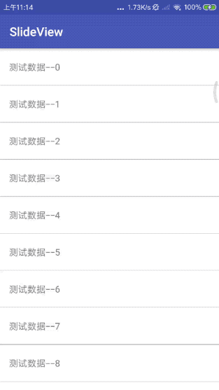

# SlideView
仿微信左滑listView出现删除按钮。一步搞定滑动菜单，在任何你需要的地方。

### 微信效果图


### Demo效果图



### Usage

#### 引用
```gradle
# project build.gradle
allprojects {
    repositories {
        ...
        maven { url 'https://jitpack.io' }
    }
}

# module build.gralde
dependencies {
    ...
    implementation 'com.github.mengxn:SlideView:1.3'
}
```

#### 方式一

在getView中，将原有itemView加入到SlideView中,并将SlideView返回就可以了
``` java
SlideView slideView = new SlideView(this);
slideView.setContentView(view);
SlideView.Option deleteOption = slideView.newOption("删除", Color.RED, new View.OnClickListener() {
    @Override
    public void onClick(View v) {
       // do something 
    }
});
slideView.addOption(deleteOption);
```

#### 方式二

``` xml
<me.codego.slideview.SlideView
    xmlns:android="http://schemas.android.com/apk/res/android"
    android:layout_width="match_parent"
    android:layout_height="match_parent">
  
	<!--这里放菜单信息-->
	
    <LinearLayout
        android:layout_width="wrap_content"
        android:layout_height="match_parent"
        android:orientation="horizontal">
        
        <!-- you can add view as you want -->
        
        <TextView
            android:id="@+id/delete"
            android:layout_width="80dp"
            android:layout_height="match_parent"
            android:gravity="center"
            android:text="删除"
            android:textColor="#FFF"
            android:textSize="16sp"/>

    </LinearLayout>
  
	<!-- 这里放item展示信息 -->
    <RelativeLayout
        android:layout_width="match_parent"
        android:layout_height="match_parent"
        android:background="#FFF">

    </RelativeLayout>

</me.codego.slideview.SlideView>
```
