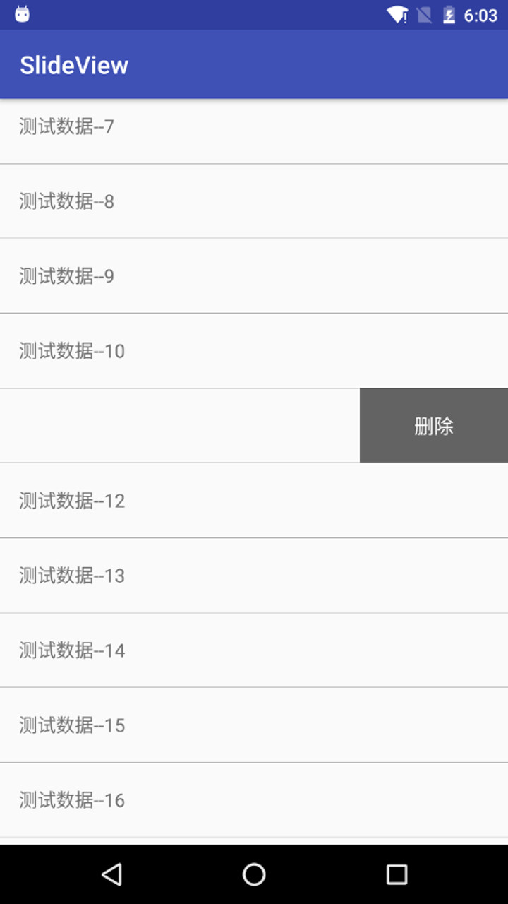

# SlideView
仿微信左滑listView 出现删除按钮

### Usage

#### 方式一

在getView中，将原有itemView加入到SlideView中,并将SlideView返回就可以了
```
SlideView slideView = new SlideView(this);
slideView.setContentView(view);
```

#### 方式二

``` xml
<me.codego.example.SlideView
    xmlns:android="http://schemas.android.com/apk/res/android"
    android:layout_width="match_parent"
    android:layout_height="match_parent">
	<!--这里放item展示信息 -->
    <RelativeLayout
        android:id="@id/content"
        android:layout_width="match_parent"
        android:layout_height="match_parent">

    </RelativeLayout>
  
	<!--这里放菜单信息-->
    <LinearLayout
        android:id="@id/holder"
        android:layout_width="160dp"
        android:layout_height="match_parent"
        android:orientation="horizontal"
        android:background="#636363">

    </LinearLayout>

</me.codego.example.SlideView>
```

###微信效果图


### Demo效果图


### PS

> 原作者应该为任玉刚，这是《Android高手开发进阶》书中的一个例子，当然也有专门的博客，地址在这[高仿微信对话列表滑动删除效果](http://blog.csdn.net/singwhatiwanna/article/details/17515543)

#### 修改

原作者是通过重写ListView和ItemView来实现功能的，感觉以后使用的话不方便，所以把所有的逻辑都放在了SlideView中。

### TODO

- 抽取成library
- 滑动菜单定制
